<table>
  <tr>
    <td colspan="4" rowspan="3">
    	 
    </td>
    <td>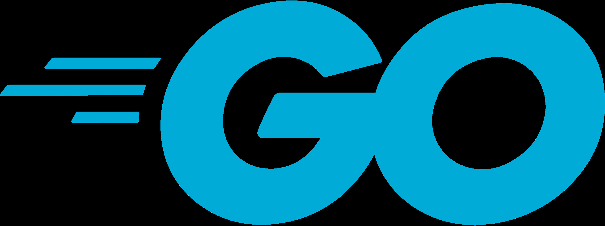</td>
    <td></td>
    <td>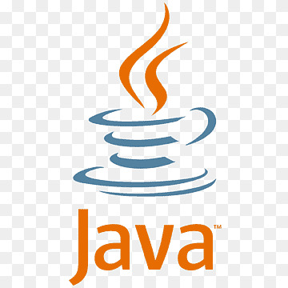</td>
    <td>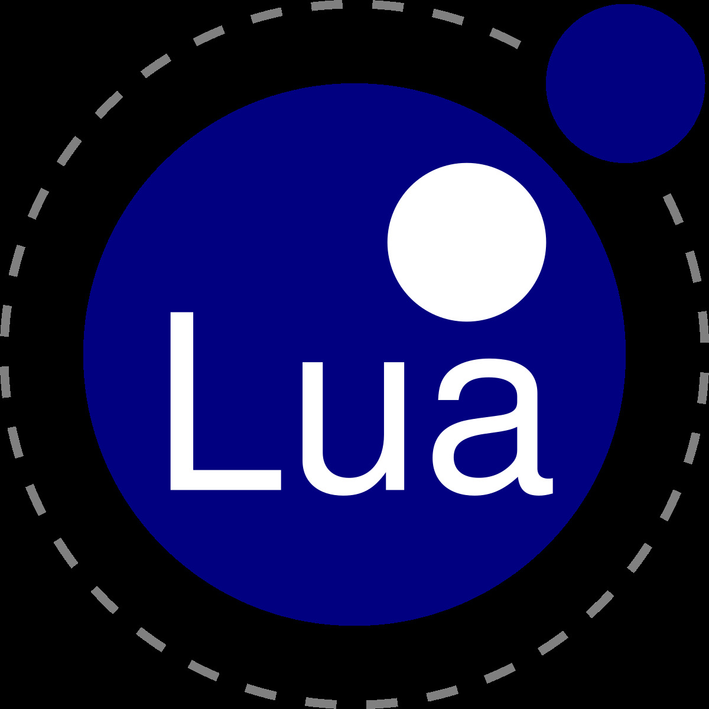</td>
  </tr>
  <tr>
    <td>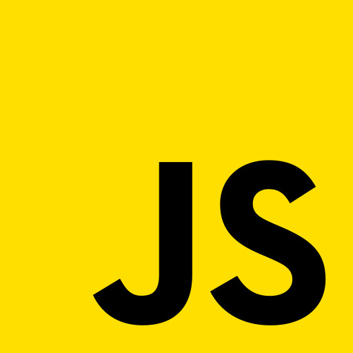</td>
    <td>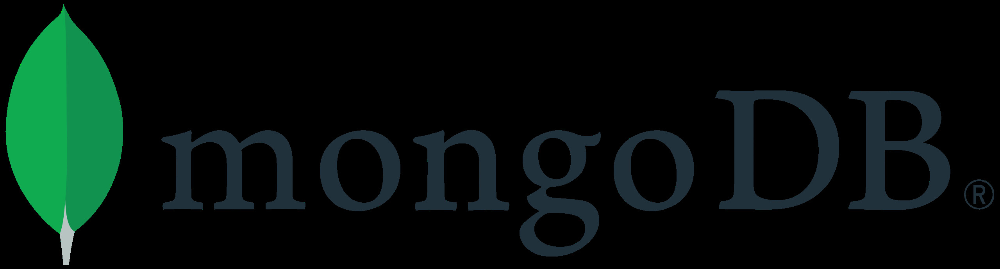</td>
    <td>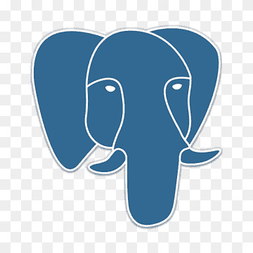</td>
    <td>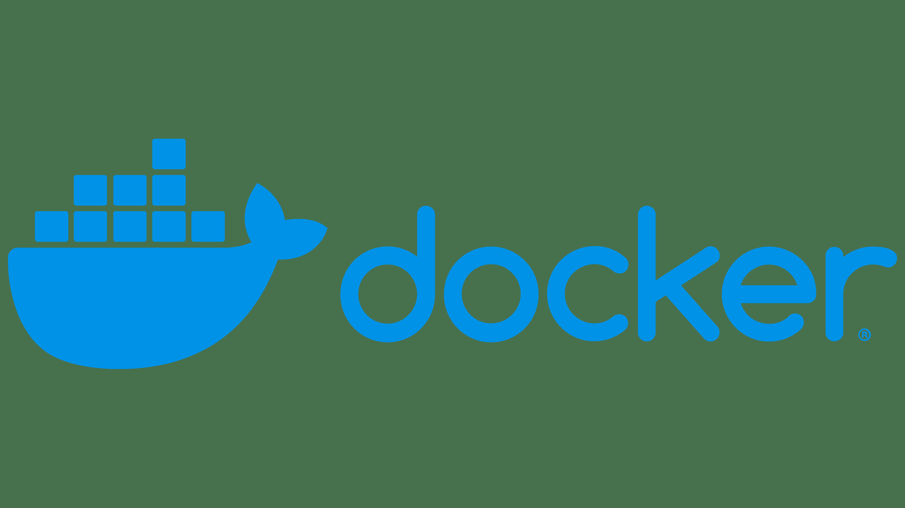</td>
  </tr>
  <tr>
    <td>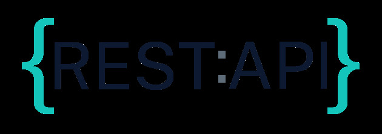</td>
    <td>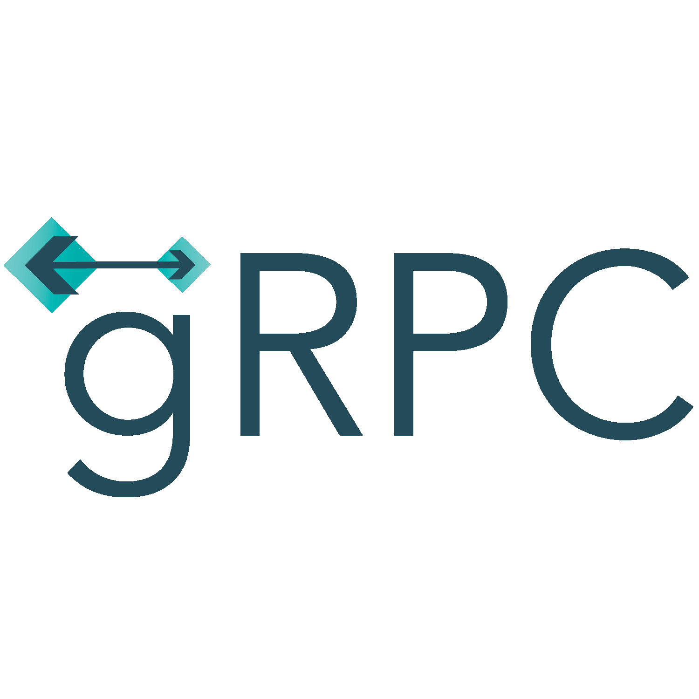</td>
    <td>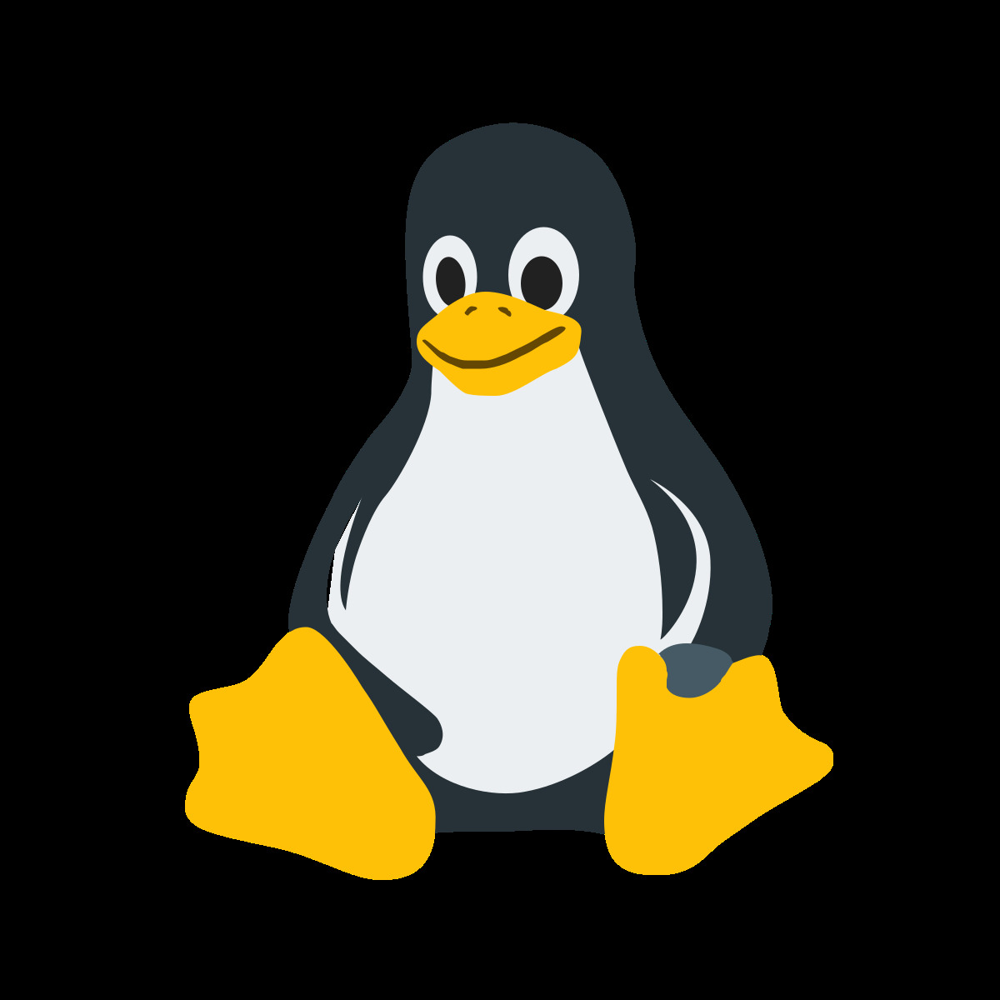</td>
    <td>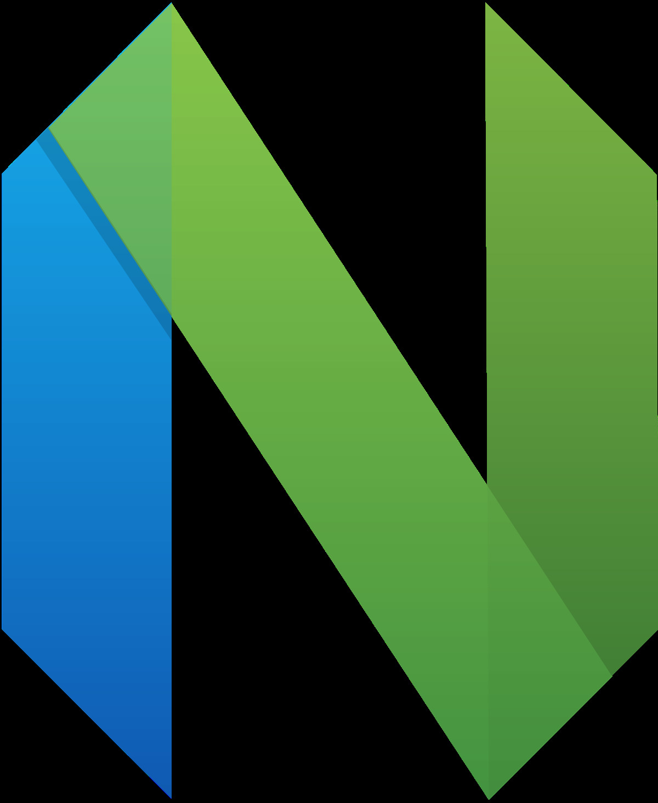</td>
  </tr>
  <tr>
    <td colspan="8" align="center">
&nbsp;&nbsp;United Nations' Sustainable Development Goals: <a href="https://sdgs.un.org/goals" target=”_blank”>sdgs.un.org/goals</a>
</td>
  </tr>
</table>

