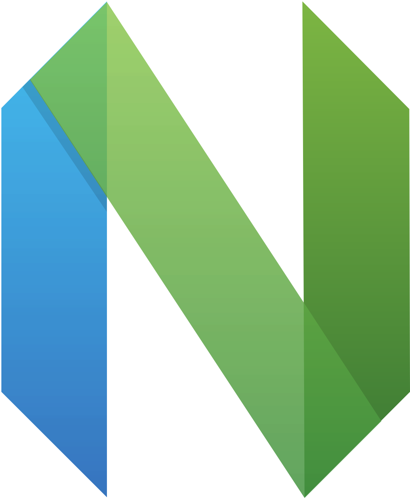

  
  <a style="float: left; max-width: 410">
    

      
      
      
      
      
      
      
      
      
      
      
      
    

    &nbsp;&nbsp;UN's Sustainable Development Goals: <a href="https://sdgs.un.org/goals" target=”_blank”>sdgs.un.org/goals</a>
  </a>

