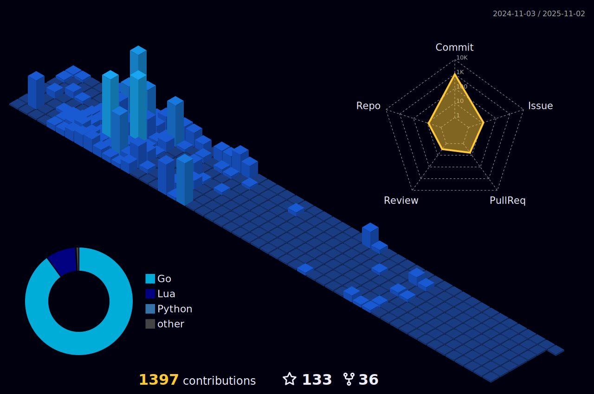

<table>
  <tr>
    <td colspan="4" rowspan="3" align="center">
    	 
    </td>
    <td align="center"></td>
    <td align="center"></td>
    <td align="center"></td>
    <td align="center"></td>
  </tr>
  <tr>
    <td align="center"></td>
    <td align="center"></td>
    <td align="center"></td>
    <td align="center"></td>
  </tr>
  <tr>
    <td align="center"></td>
    <td align="center"></td>
    <td align="center"></td>
    <td align="center"></td>
  </tr>
</table>

  <b><i>Information, Knowledge, Education, and Instruction must always be open and free.</i></b> 
  <b>Modern Software Engineer Archive:</b>&nbsp;<a href="https://github.com/lavantien/modern-swe-library">https://github.com/lavantien/modern-swe-library</a>

