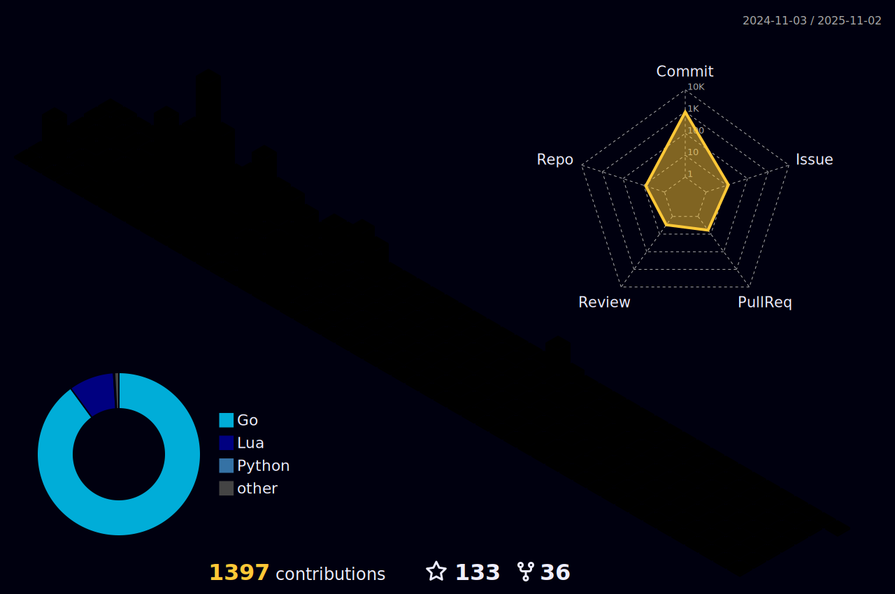

  

 

Finding peace.

- **Core**: Go, JS/TS | Node, React | MongoDB, PostgreSQL, Redis | RESTful, GRPC, GraphQL | Docker, Git, CI/CD | Microservices

- **Secondary**: Rust, Dart, C++, Java, Python | Flutter | Firebase | NATS, Kafka | Kubernetes, Terraform | Linux, Edge, SRE

- **Reading**: Dīgha Nikāya, Majjhima Nikāya, Saṃyukta Nikāya, Aṅguttara Nikāya, Khuddaka Nikāya | Vinaya Piṭaka | Milinda Pañha, Visuddhimagga, Vimuttimagga | Distributed Services with Go, The Rust Programming Language, Practical MongoDB Aggregations Book

- **Life Style and Nutrition**:   https://www.reddit.com/user/AriyaSavaka/comments/xar38y/notes_on_healthy_lifestyle_and_nutrition/

- **Programming Training Resources**:  
https://www.reddit.com/user/AriyaSavaka/comments/x5i7zn/resource_collection/

